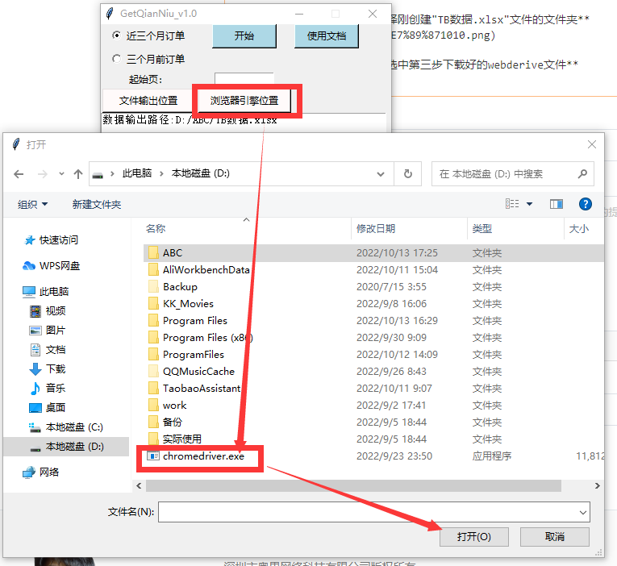

# **1. 查看系统安装的操作系统版本** 
打开浏览器 => 右上角三点展开 => 帮助 => 关于：可以查看到浏览器版本号。  

# **2.下载对应的webderive** 
Chrome 浏览器历史版本下载地址
Chrome：https://www.slimjet.com/chrome/google-chrome-old-version.php   

Chrome webderive下载地址
Chrome：https://chromedriver.storage.googleapis.com/index.html   
==============================================================
Firefox 浏览器下载地址
Firefox：https://ftp.mozilla.org/pub/firefox/releases/99.0b8/win64/zh-CN/   

Firefox webderive下载地址
Firefox：https://github.com/mozilla/geckodriver/releases/
=========================================================
Edge 浏览器下载地址（根据操作系统版本下载）
Edge: https://www.microsoft.com/zh-cn/edge?form=MA13FJ  

Edge webderive下载地址
Edge: https://developer.microsoft.com/en-us/microsoft-edge/tools/webdriver/  
 **这里以Chrome谷歌浏览器为例：** 

浏览器版本号为：版本 106.0.5249.119（正式版本），下载Chrome webderive对应的版本号为：106.0.5249中选一个，根据操作系统选择驱动，Windows都选择chromedriver_win32.zip这个文件。

===========================================================================
# **3.将下载到的webderive文件解压存放到指定文件路径** 
例如：存放入 D:盘里

# **4.激活软件** 
打开软件目录里的start.exe文件，复制身份标识发送给管理员

# **5.管理员发送会激活码，将激活码填入激活框，点击激活成功激活软件** 

# **6.电脑端任意文件夹下新建一个文件名为： **_TB数据.xlsx_**  文件** 

# **7.点击文件输出位置，选择刚创建"TB数据.xlsx"文件的文件夹**

# **8.浏览器引擎位置按钮，选中第三步下载好的webderive文件**

# **9.下面就可以开心的爬取数据了** 
订单可以选近三个月的订单，或者三个月前的订单，默认选择近三个月订单。  
起始页表示要从第几页开始获取，如果不填默认从第一页开始。  
数据获取需要登录千牛网页客户端，登录页面弹出后，需要在二十分钟钟内登录。

如果浏览器会阻挡弹出需要手动允许千牛网页弹窗。
